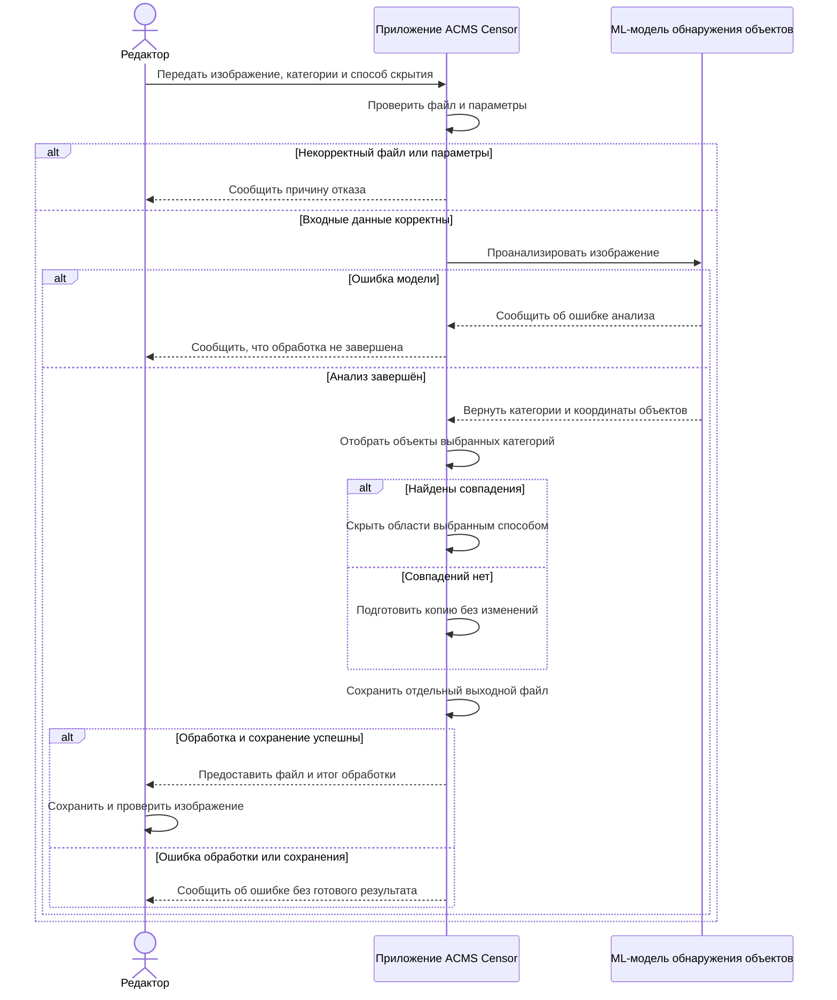
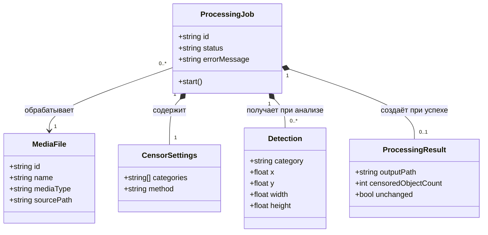

# Диаграммы

## Диаграмма последовательности

Диаграмма соответствует [UC-01 «Автоматическая цензура изображения»](requirements.md#uc-01): редактор передаёт файл, приложение вызывает ML-модель, скрывает выбранные объекты и предоставляет результат.

## Диаграмма классов

Модель содержит пять сущностей: исходный медиафайл, параметры цензуры, задание обработки, обнаруженный объект и результат. Для [UC-01](requirements.md#uc-01) рассматриваются изображения и координаты визуальных объектов.

Один исходный файл может обрабатываться несколько раз с разными параметрами. Задание содержит один набор параметров и от нуля до нескольких обнаружений. При успешной обработке оно создаёт один результат; при ошибке результат отсутствует. Если объектов выбранных категорий нет, результат содержит путь к копии без изменений, `censoredObjectCount = 0` и `unchanged = true`.
